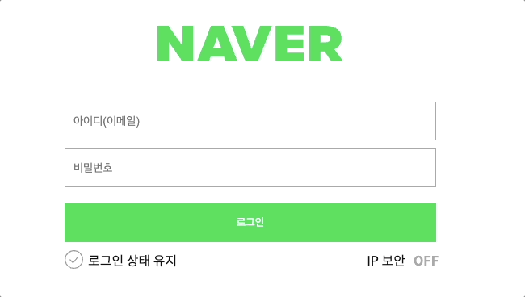
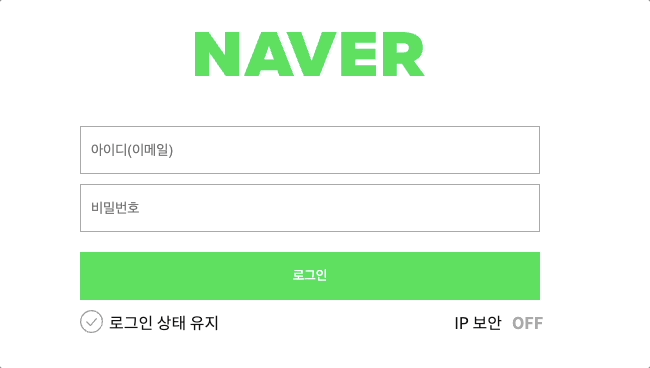
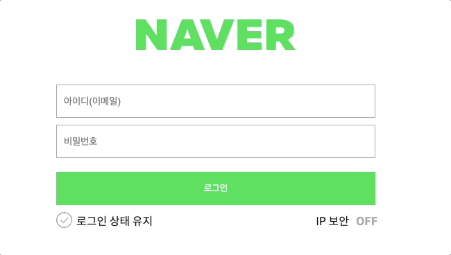

# 네이버 로그인 페이지 구현

---

로그인과 비밀번호를 정확히 입력했을 때 welcome 페이지로 넘어갈 수 있도록 코드 로직을 작성합니다.

---

- [x] 재사용 가능한 함수를 분리하고 함수를 중심으로 설계하는 방법에 대해 학습합니다.

| ID만 입력했을때 | 비밀번호만 입력했을때 | 다음페이지 | 아이디or비밀번호 틀렸을시 |
| --- | --- | --- | --- |
|  |  |  |  |

<h4>변수 지정</h4>

```js
// 변수 입력은 이렇게 4개로 지정해줬습니다.
const inputEmail = document.querySelector(".user-email-input");
const inputPassword = document.querySelector(".user-password-input");
const button = document.querySelector(".btn-login");
const clickError = document.querySelector(".input-error");
```

<h4>html에 아이디 or 비밀번호 Error창 추가.</h4>

```html
<span class="error-message input-error" id="userIdPasswordError"
  >아이디(로그인 전용 아이디)or비밀번호를 잘못 입력했습니다.<br />
  입력하신 내용을 다시 확인해주세요.</span
>
```

<h4>아이디 Error</h4>

```js
// 아이디 잘못 입력시 오류
if (emailReg(inputEmail.value) || inputEmail.value === "") {
  inputEmail.classList.remove("is--invalid");
} else {
  inputEmail.classList.add("is--invalid");
  clickError.style.display = "none";
}
```

- 아이디 입력시 이메일 형태가 아니면 Error.
- 이메일 형태가 맞으면 완료.
- Error가 뜨면 사라지지 않아 사라지게 했다.

<h4>비밀번호 Error</h4>

```js
// 비밀번호 잘못 입력시 오류
if (pwReg(inputPassword.value) || inputPassword.value === "") {
  inputPassword.classList.remove("is--invalid");
} else {
  inputPassword.classList.add("is--invalid");
  clickError.style.display = "none";
}
```

- 비밀번호 입력시 조건에 안맞으면 Error.
- 비밀번호 형태가 맞으면 완료.
- Error가 뜨면 사라지지 않아 사라지게 했다.

<h4>아이디 비밀번호 일치할때 다음페이지.</h4>

```js
// 아이디 비밀번호 일치하면 다음 페이지 넘어가기.
if (inputEmail.value === user.id && inputPassword.value === user.pw)
  window.location.href = "welcome.html";
```

- 아이디 비밀번호 일치하면 다음페이지로 이동.

<h4>아이디 or 비밀번호 틀린 상태에서 로그인 할때.</h4>

```js
   else {
    clickError.style.display = "block";
    inputEmail.classList.remove("is--invalid");
    inputPassword.classList.remove("is--invalid");
  }
```

- 아이디 또는 비밀번호 틀리게 입력하고 로그인시 Error.
- 이메일, 비밀번호 Error가 사라지지 않아서 remove로 사라지게 추가.
- Error가 뜨면 사라지지 않아 `display = "block";` 으로 안보이게 했다.
